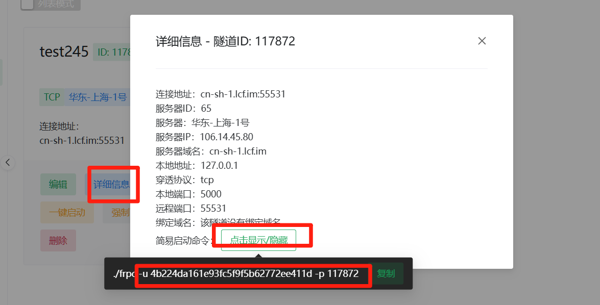
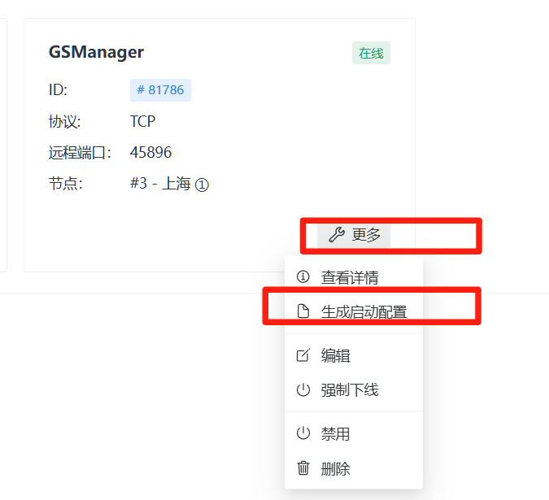
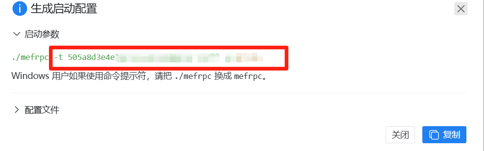
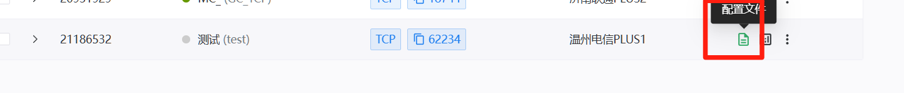
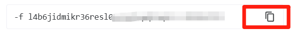

# 内网穿透的使用方法

## LoCyanFrp（乐青映射）

[https://www.locyanfrp.cn/](https://www.locyanfrp.cn/)

1.进入隧道面板点击详细信息

2.找到简易启动命令复制

3.进入GameServerManager

4.点击内网穿透

 选择**LoCyanFrp**

 填写**配置名字**和**启动参数** 然后创建

‍

## ME Frp （幻缘映射）

[https://www.mefrp.com/](https://www.mefrp.com/)

1.点击更多 生成启动配置

2.复制启动参数 到**GameServerManager**

 选择ME Frp

 填写**配置名字**和**启动参数** 然后创建

‍

## 樱花Frp （SaKura Frp）

[https://www.natfrp.com/](https://www.natfrp.com/)

1.进入隧道列表 点击配置文件

2.复制启动参数到 **GameServerManager**

选择 **SaKura Frp**

填写**配置名字**和**启动参数** 然后创建

‍
