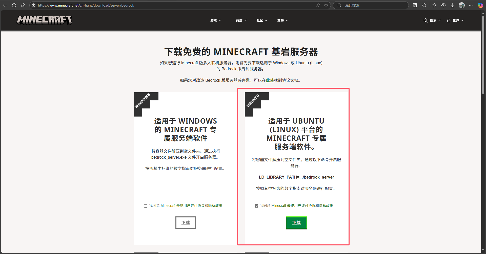
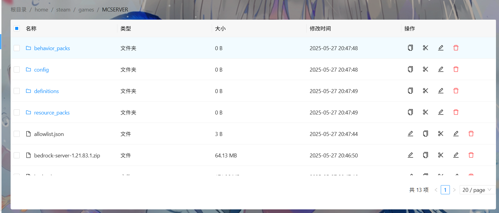
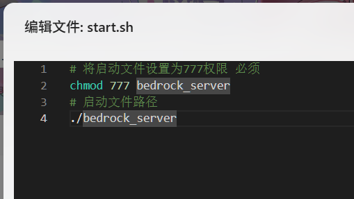
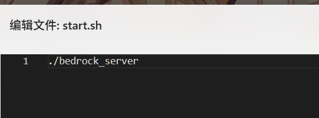
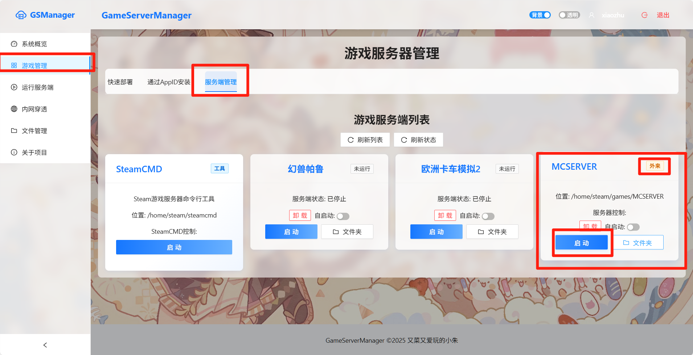

# 导入第三方游戏服务端

容器已经安装了市场主流引擎的运行库，这意味着您可以开几乎所有支持Linux服务端的游戏。

## 进入Minecraft基岩服务端官网

[基岩版服务器下载 | Minecraft](https://www.minecraft.net/zh-hans/download/server/bedrock)

1. 下载Linux服务端到**本地**

2. 在**Games**目录新建一个文件在随便取一个名字

3. 把下载的服务端上传到你创建的文件夹里，这里以MCSERVER举例

4. 新建启动脚本 `start.sh`​ 双击编辑，填入服务端启动命令然后保存启动即可，这里以MCBE为例

5. 返回服务端管理刷新即可看到游戏列表点击启动即可

6. 如果存在报错说明启动脚本有问题，可以在后台容器日志查看对应的启动失败的详细原因
