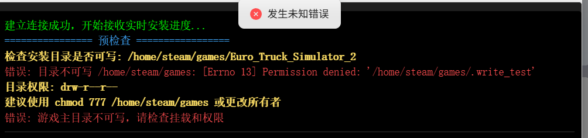

# 常见问题

# Q：安装steam服务端权限检测不通过

A：宿主权限问题

您需要将容器路径为 `/home/steam/games `​的宿主路径文件夹权限修改为777

然后重新运行安装即可

‍

# Q：game_file（存档路径）文件夹始终没有文件，或游戏报错存档写入失败

A：权限问题

您需要将容器路径为 `/game_file:/home/steam/.config`​ `/game_file:/home/steam/.local`​的宿主路径文件夹权限修改为777

然后重新运行游戏服务端即可
